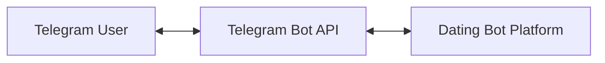
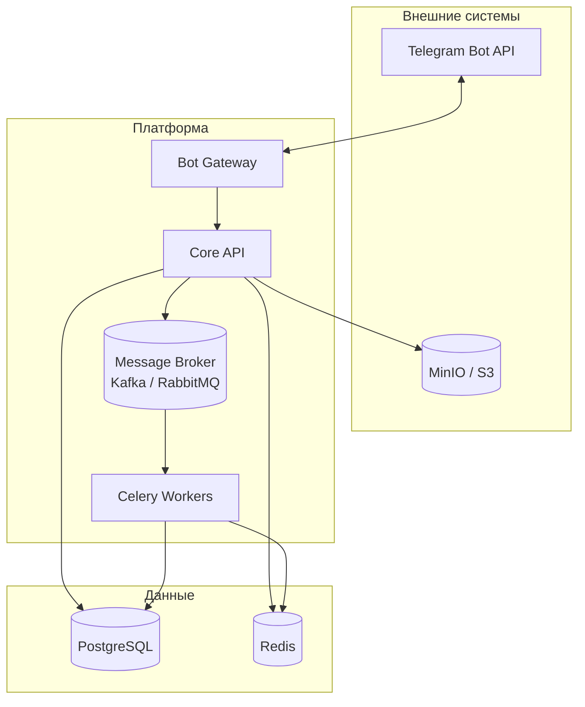
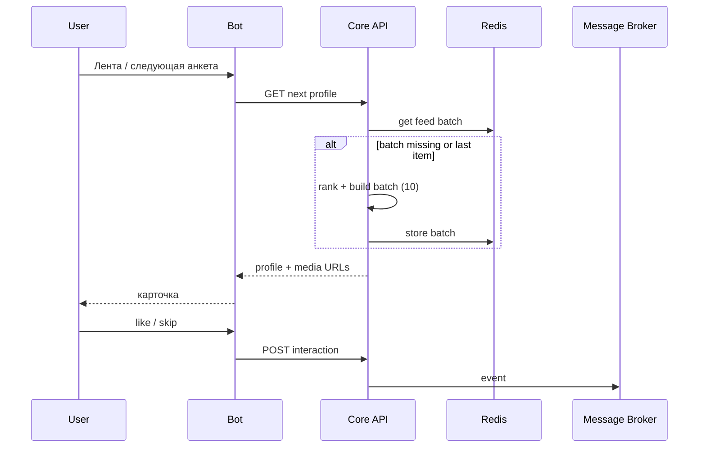

# Архитектура и схема системы

## Общая идея

Клиент — только Telegram. Backend обрабатывает команды, читает и пишет данные в PostgreSQL, кэширует выдачу в Redis, кладёт события взаимодействий в очередь для асинхронной обработки, хранит файлы в S3-совместимом хранилище. Воркеры Celery пересчитывают рейтинги и обновляют кэш по политике приложения.

## Диаграмма контекста (C4: System Context)



## Диаграмма контейнеров (логические компоненты)



## Схема БД (связи таблиц)

Ниже — ER-диаграмма по [`schema.sql`](schema.sql): справочники, пользователь и анкета, лента/мэтчи/сообщения, рефералы. Составной ключ `profile_interests` связывает анкеты и теги интересов (M:N).

```mermaid
erDiagram
  ref_genders {
    varchar code PK
    smallint sort_order
  }

  ref_interaction_actions {
    varchar code PK
  }

  users {
    bigint id PK
    bigint telegram_id UK
    varchar username
    varchar first_name
    varchar last_name
  }

  user_preferences {
    bigint user_id PK_FK
    smallint age_min
    smallint age_max
    varchar gender_preference
    varchar city_preference
  }

  profiles {
    bigint id PK
    bigint user_id FK_UK
    varchar display_name
    varchar gender_code FK
    varchar city
    smallint profile_completeness
  }

  interests {
    smallint id PK
    varchar slug UK
    varchar title
  }

  profile_interests {
    bigint profile_id PK_FK
    smallint interest_id PK_FK
  }

  profile_photos {
    bigint id PK
    bigint profile_id FK
    varchar storage_key
  }

  profile_ratings {
    bigint profile_id PK_FK
    numeric primary_score
    numeric behavioral_score
    numeric combined_score
  }

  interactions {
    bigint id PK
    bigint viewer_id FK
    bigint viewed_id FK
    varchar action_code FK
  }

  matches {
    bigint id PK
    bigint user_low_id FK
    bigint user_high_id FK
  }

  messages {
    bigint id PK
    bigint match_id FK
    bigint sender_id FK
    varchar body
  }

  referrals {
    bigint id PK
    bigint referrer_id FK
    bigint referred_id FK_UK
  }

  ref_genders ||--o{ profiles : "gender_code"
  users ||--|| profiles : "1 анкета"
  users ||--|| user_preferences : "фильтры ленты"
  users ||--o{ interactions : "viewer"
  users ||--o{ interactions : "viewed"
  ref_interaction_actions ||--o{ interactions : "action_code"
  users ||--o{ matches : "user_low_id"
  users ||--o{ matches : "user_high_id"
  matches ||--o{ messages : "чат"
  users ||--o{ messages : "sender_id"
  profiles ||--o{ profile_photos : "фото"
  profiles ||--|| profile_ratings : "рейтинги"
  profiles ||--o{ profile_interests : ""
  interests ||--o{ profile_interests : ""
  users ||--o{ referrals : "referrer_id"
  users ||--o| referrals : "referred_id"
```

Кратко по кардинальности:

| Связь | Смысл |
|--------|--------|
| `users` ↔ `profiles` | 1:1 (один пользователь — одна анкета) |
| `users` ↔ `user_preferences` | 1:1 |
| `profiles` ↔ `ref_genders` | N:1 (пол из справочника, может быть не задан) |
| `profiles` ↔ `interests` | M:N через `profile_interests` |
| `users` ↔ `interactions` | два ребра: кто смотрит / кого смотрят; пара `(viewer, viewed)` уникальна |
| `users` ↔ `matches` | два ребра: `user_low_id` &lt; `user_high_id`, пара пользователей уникальна |
| `matches` ↔ `messages` | 1:N |
| `users` ↔ `referrals` | пригласивший 1:N к записям; у приглашённого не больше одной строки (`referred_id` UNIQUE) |

## Поток: сессия и «пачка» из 10 анкет

1. Пользователь открывает ленту; Bot вызывает API «дать следующую анкету».
2. API проверяет Redis: есть ли готовая очередь ID профилей для этого пользователя.
3. Если очередь пуста или заканчивается — Matching/Rating формирует новую порцию (например, 10 ID), ранжирует, кладёт в Redis; первую отдаёт в ответ.
4. События «показ», «лайк», «скип» публикуются в брокер; воркеры обновляют поведенческий рейтинг и при необходимости инвалидируют/дополняют кэш.



## Развёртывание (ориентир)

- Один или несколько инстансов API + Bot (или Bot как отдельный процесс, вызывающий тот же API).
- Воркеры Celery горизонтально масштабируются; брокер и Redis/PostgreSQL — отказоустойчивые конфигурации по мере необходимости.

---

Схема данных: DDL в [`schema.sql`](schema.sql), связи — раздел «Схема БД» выше и `README.md`.
