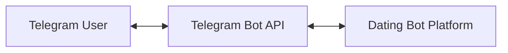
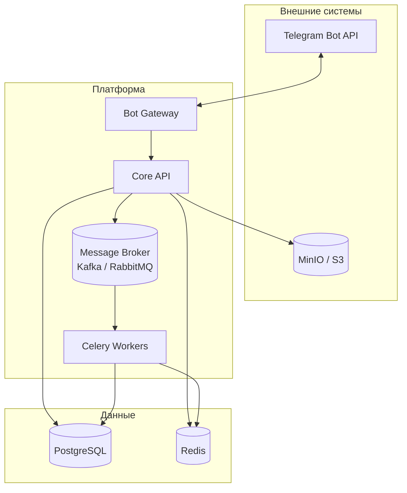
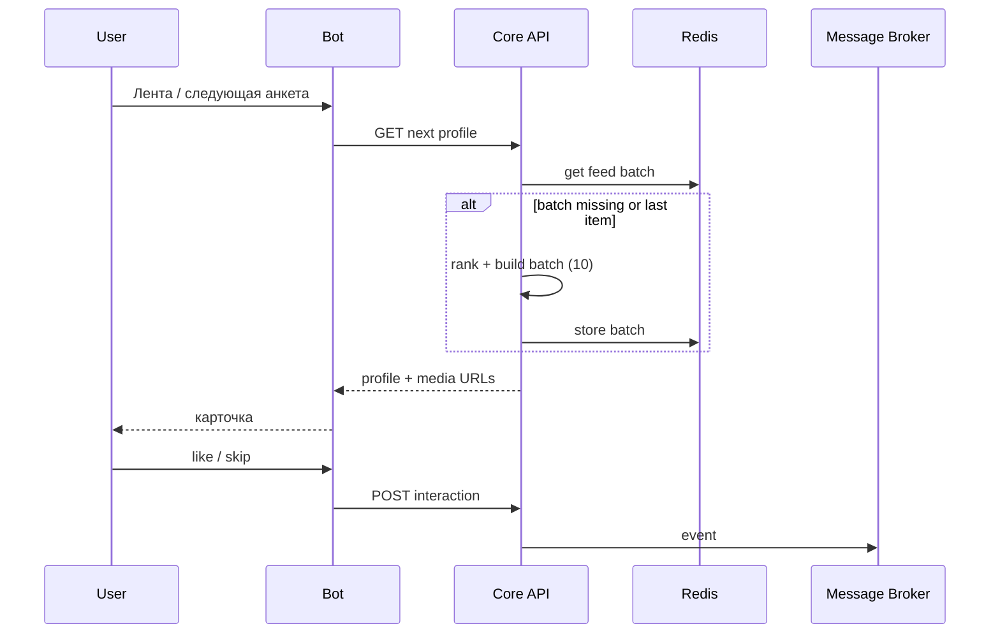

# Архитектура и схема системы

## Общая идея

Клиент — только Telegram. Backend обрабатывает команды, читает и пишет данные в PostgreSQL, кэширует выдачу в Redis, кладёт события взаимодействий в очередь для асинхронной обработки, хранит файлы в S3-совместимом хранилище. Воркеры Celery пересчитывают рейтинги и обновляют кэш по политике приложения.

## Диаграмма контекста (C4: System Context)

## Диаграмма контейнеров (логические компоненты)

## Поток: сессия и «пачка» из 10 анкет

1. Пользователь открывает ленту; Bot вызывает API «дать следующую анкету».
2. API проверяет Redis: есть ли готовая очередь ID профилей для этого пользователя.
3. Если очередь пуста или заканчивается — Matching/Rating формирует новую порцию (например, 10 ID), ранжирует, кладёт в Redis; первую отдаёт в ответ.
4. События «показ», «лайк», «скип» публикуются в брокер; воркеры обновляют поведенческий рейтинг и при необходимости инвалидируют/дополняют кэш.

## Развёртывание (ориентир)

- Один или несколько инстансов API + Bot (или Bot как отдельный процесс, вызывающий тот же API).
- Воркеры Celery горизонтально масштабируются; брокер и Redis/PostgreSQL — отказоустойчивые конфигурации по мере необходимости.

---

Схема данных — в `schema.sql` и кратком описании внизу `README.md`.
