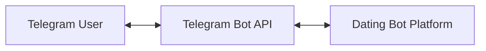
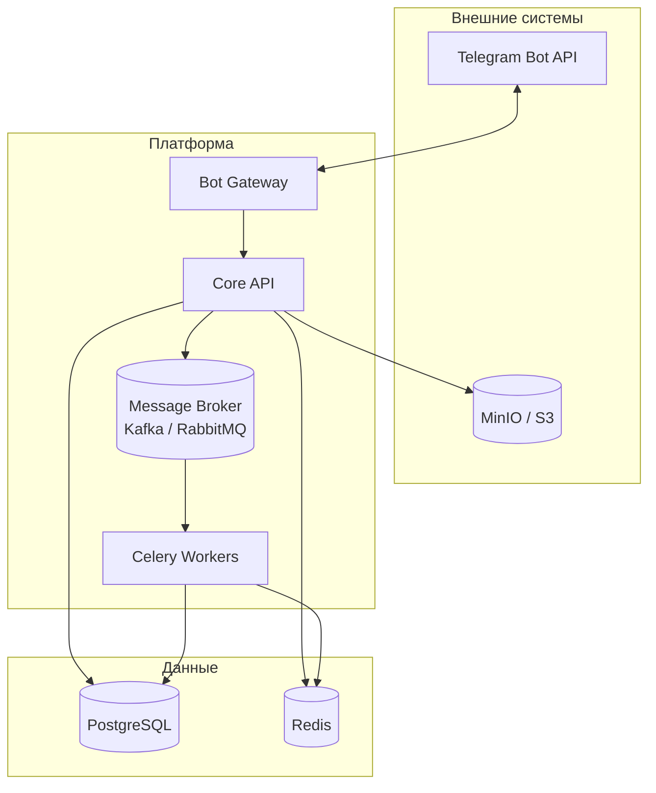
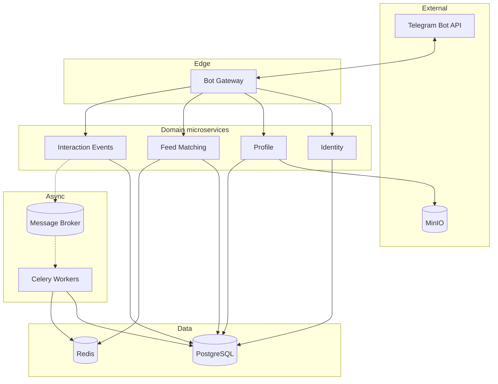
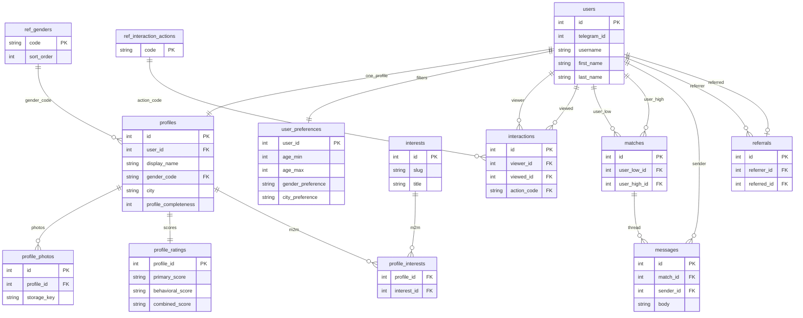
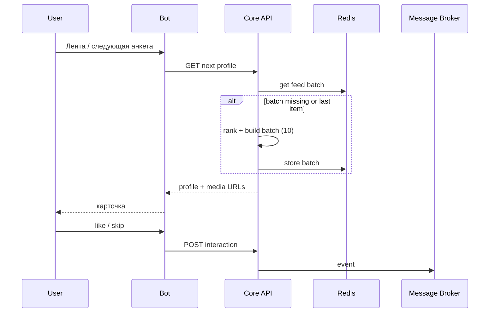

# Архитектура и схема системы

## Общая идея

Клиент — только Telegram. Backend обрабатывает команды, читает и пишет данные в PostgreSQL, кэширует выдачу в Redis, кладёт события взаимодействий в очередь для асинхронной обработки, хранит файлы в S3-совместимом хранилище. Воркеры Celery пересчитывают рейтинги и обновляют кэш по политике приложения.

## Диаграмма контекста (C4: System Context)

## Диаграмма контейнеров (логические компоненты)

## Схема взаимодействия микросервисов

Логические сервисы и зоны ответственности — в [`01-services.md`](01-services.md). Ниже — как они связаны: **сплошные стрелки** — синхронные вызовы (HTTP/gRPC) от Bot Gateway к доменным сервисам и к хранилищам; **пунктир** — асинхронная публикация событий в брокер и обработка воркерами (пересчёт рейтингов, метрики, инвалидация кэша).

Кратко по потокам:

| Направление | Что происходит |
|-------------|----------------|
| Bot Gateway → Identity | Регистрация/поиск пользователя по `telegram_id`, выдача внутреннего `user_id`. |
| Bot Gateway → Profile | CRUD анкеты, метаданные фото; загрузка файлов в MinIO (presigned URL или прокси). |
| Bot Gateway → Feed Matching | Следующая анкета, пачка ID в Redis, фильтры из `user_preferences`. |
| Bot Gateway → Interaction | Лайк/скип/мэтч, запись в БД, **публикация события** в брокер. |
| Broker → Celery | Обработка событий: поведенческий и комбинированный рейтинг, обновление `profile_ratings`, при необходимости правка кэша в Redis. |

На защите можно показать тот же рисунок и сказать, что сервисы допускается собрать в **один деплой** (модули монолита), но границы и потоки данных остаются такими же.

## Схема БД (связи таблиц)

Ниже — ER-диаграмма по [`schema.sql`](schema.sql): справочники, пользователь и анкета, лента/мэтчи/сообщения, рефералы. Составной ключ `profile_interests` связывает анкеты и теги интересов (M:N). Типы в Mermaid упрощены (`string`/`int`), чтобы диаграмма открывалась в GitHub; точные типы PostgreSQL — только в DDL.

Кратко по кардинальности:

| Связь | Смысл |
|--------|--------|
| `users` ↔ `profiles` | 1:1 (один пользователь — одна анкета) |
| `users` ↔ `user_preferences` | 1:1 |
| `profiles` ↔ `ref_genders` | N:1 (пол из справочника, может быть не задан) |
| `profiles` ↔ `interests` | M:N через `profile_interests` |
| `users` ↔ `interactions` | два ребра: кто смотрит / кого смотрят; пара `(viewer, viewed)` уникальна |
| `users` ↔ `matches` | два ребра: `user_low_id` &lt; `user_high_id`, пара пользователей уникальна |
| `matches` ↔ `messages` | 1:N |
| `users` ↔ `referrals` | пригласивший 1:N к записям; у приглашённого не больше одной строки (`referred_id` UNIQUE) |

## Поток: сессия и «пачка» из 10 анкет

1. Пользователь открывает ленту; Bot вызывает API «дать следующую анкету».
2. API проверяет Redis: есть ли готовая очередь ID профилей для этого пользователя.
3. Если очередь пуста или заканчивается — Matching/Rating формирует новую порцию (например, 10 ID), ранжирует, кладёт в Redis; первую отдаёт в ответ.
4. События «показ», «лайк», «скип» публикуются в брокер; воркеры обновляют поведенческий рейтинг и при необходимости инвалидируют/дополняют кэш.

## Развёртывание (ориентир)

- Один или несколько инстансов API + Bot (или Bot как отдельный процесс, вызывающий тот же API).
- Воркеры Celery горизонтально масштабируются; брокер и Redis/PostgreSQL — отказоустойчивые конфигурации по мере необходимости.

---

Схема данных: DDL в [`schema.sql`](schema.sql), связи — раздел «Схема БД» выше и `README.md`.
