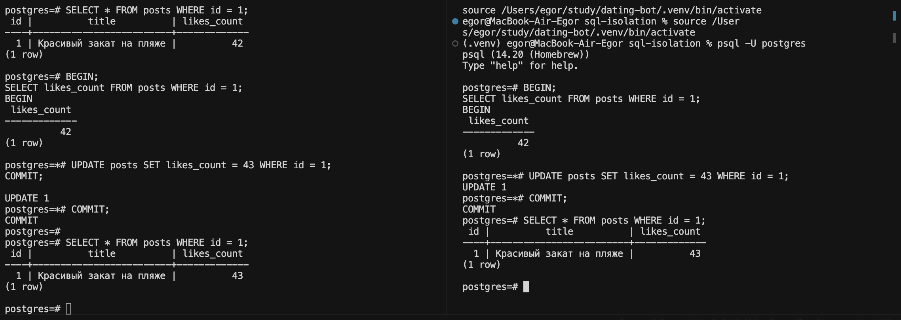
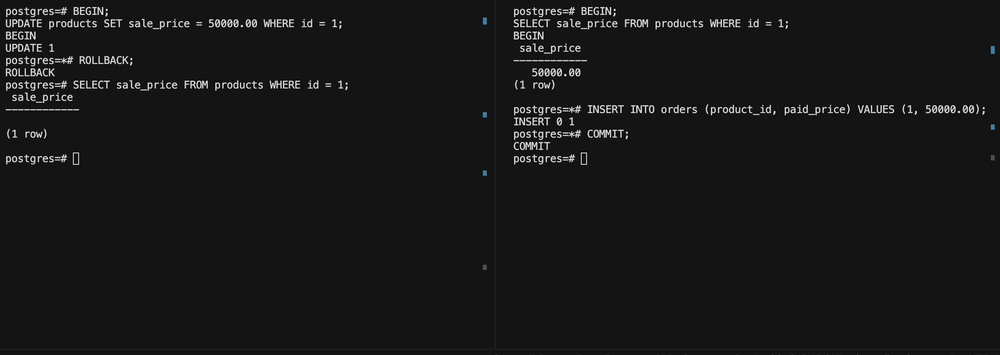
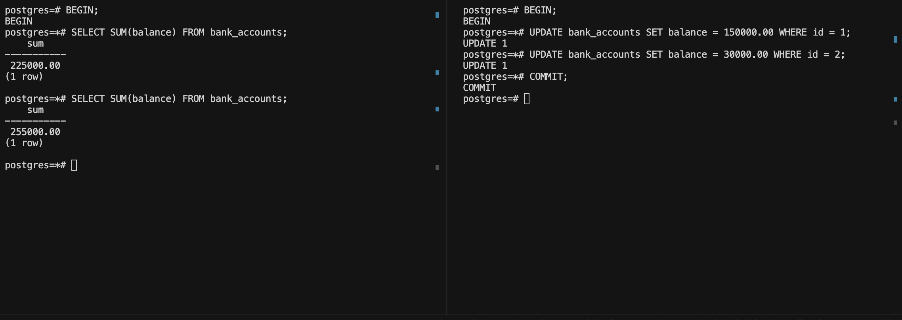
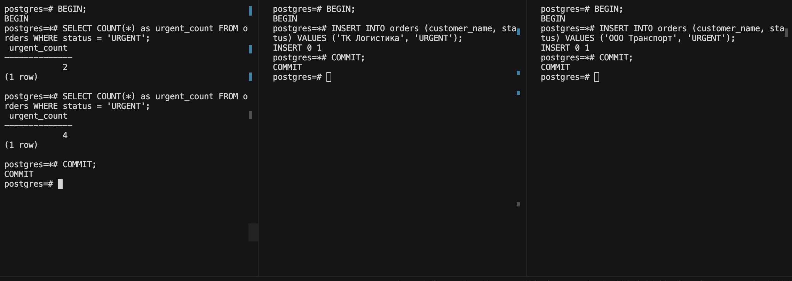

# Аномалии изоляции в SQL: Практический отчет

## Зачем это нужно?

Когда в базу одновременно ходят несколько запросов, начинаются проблемы. Две транзакции могут "наступить друг другу на ноги", и в результате теряются данные, видны неверные значения, или появляются "фантомные" строки. Вот об этих проблемах я и расскажу — с реальными примерами, не из учебника.

Я буду показывать ситуации из жизни: лайки в соцсети, скидки в магазине, финансовые отчеты, срочные заказы. Все просто и понятно.

## Четыре аномалии, которые мы разберем

1. **Lost Update** — лайки теряются
2. **Dirty Read** — видите цену, которой нет
3. **Non-repeatable Read** — один запрос возвращает разные результаты
4. **Phantom Read** — вдруг появляются новые заказы в запросе

---

## Аномалия 1: Lost Update (Потеря обновления)

### Что это такое?

Воображаете: два пользователя одновременно нажимают "лайк" на один пост. Логично, что счетчик должен увеличиться на 2. Но вместо этого увеличивается всего на 1. Один лайк просто теряется в базе.

Почему? Потому что обе транзакции прочитали старое значение (42), добавили по 1 (получили 43), и обе записали 43 обратно. Второе обновление просто перезаписало первое.

### Реальный пример: Инстаграм

Пост "Красивый закат на пляже" уже получил 42 лайка.

- Иван и Маша одновременно решили поставить лайк
- Обоим показывается 42
- Оба вычисляют 42 + 1 = 43
- Оба пишут 43 в базу
- Вместо 44 лайков получается 43

### Как это воспроизвести

Сначала подготовим данные:

```sql
CREATE TABLE posts (id SERIAL PRIMARY KEY, title TEXT, likes_count INTEGER DEFAULT 0);
INSERT INTO posts VALUES (1, 'Красивый закат на пляже', 42);
```

Теперь откройте две сессии БД одновременно.

**Сессия 1 (Иван):**

1. `BEGIN;` — начинаем транзакцию
2. `SELECT likes_count FROM posts WHERE id = 1;` — видим 42
3. (ждите, пока Маша выполнит свой SELECT)
4. `UPDATE posts SET likes_count = 43 WHERE id = 1;` — обновляем
5. (ждите, пока Маша закоммитит)
6. `COMMIT;` — отправляем изменения

**Сессия 2 (Маша):**

1. `BEGIN;`
2. `SELECT likes_count FROM posts WHERE id = 1;` — тоже видит 42 (Иван еще не закоммитил)
3. `UPDATE posts SET likes_count = 43 WHERE id = 1;` — тоже обновляет на 43
4. `COMMIT;` — коммитит первой

**Проверка результата:**

```sql
SELECT * FROM posts WHERE id = 1;
```

Ожидали 44, получили 43. Один лайк потерялся!

### Как это исправить?

**Вариант 1: Самый простой — атомарное обновление** ✅

```sql
UPDATE posts SET likes_count = likes_count + 1 WHERE id = 1;
```

Вместо "прочитай, прибавь, запиши" вы сразу говорите БД: "добавь 1". БД сама гарантирует, что каждый +1 будет учтен. Никаких потерь. Это лучший способ для счетчиков.

**Вариант 2: Максимум безопасности — SERIALIZABLE**

```sql
SET TRANSACTION ISOLATION LEVEL SERIALIZABLE;
BEGIN;
SELECT likes_count FROM posts WHERE id = 1;
UPDATE posts SET likes_count = likes_count + 1 WHERE id = 1;
COMMIT;
```

БД сделает так, что две такие транзакции не смогут выполняться одновременно. Медленнее, но безопаснее.

**Вариант 3: Блокирование**

```sql
BEGIN;
SELECT likes_count FROM posts WHERE id = 1 FOR UPDATE;  -- заблокировали строку
UPDATE posts SET likes_count = likes_count + 1 WHERE id = 1;
COMMIT;
```

Первая транзакция блокирует строку, вторая ждет. Гарантировано безопасно.

**Вариант 4: Версионирование (для спецслучаев)**

```sql
ALTER TABLE posts ADD COLUMN version INTEGER DEFAULT 0;

-- Обновляем только если версия совпадает:
UPDATE posts
SET likes_count = likes_count + 1, version = version + 1
WHERE id = 1 AND version = @expected_version;

-- Если версия изменилась - UPDATE не выполнится,
-- нужно повторить попытку с новой версией
```



---

## Аномалия 2: Dirty Read (Грязное чтение)

### Что это?

Вы читаете данные, которые еще не сохранены. Другая транзакция их изменила, но потом передумала и откатила изменения. А вы уже успели что-то сделать на основе этих "грязных" данных.

Пример из жизни: администратор магазина ввел скидку 50%, но потом нажал отмену. Но покупатель в промежутке уже увидел скидку и оплатил товар по низкой цене. Убыток 50 тыс рублей!

### Как это происходит

Подготовка:

```sql
CREATE TABLE products (id SERIAL PRIMARY KEY, name TEXT, price DECIMAL(10,2), sale_price DECIMAL(10,2));
INSERT INTO products VALUES (1, 'Ноутбук Pro', 100000.00, NULL);
```

**Сессия 1 (Администратор, делает скидку):**

1. `BEGIN;`
2. `UPDATE products SET sale_price = 50000.00 WHERE id = 1;` — ввел скидку
3. (пауза — думает, нужна ли такая большая скидка)

**Сессия 2 (Покупатель Алексей, одновременно):**

1. `SELECT sale_price FROM products WHERE id = 1;` — видит 50000 (грязное чтение!)
2. "Вау, скидка вдвое!"
3. `INSERT INTO orders VALUES (1, 50000.00);` — оплатил по низкой цене
4. `COMMIT;` — сохранил заказ

**Администратор решил отменить скидку:**

```sql
ROLLBACK;  -- отмена, скидка больше не существует
```

**Итог:**

- Администратор: скидки не было (ROLLBACK)
- Алексей: заказал товар за 50000
- Магазин потерял 50000 рублей!

Проблема в том, что Алексей прочитал данные, которые никогда не были сохранены в БД.

### Как избежать?

**Вариант 1: Просто используйте READ COMMITTED (или выше)** ✅

```sql
SET TRANSACTION ISOLATION LEVEL READ COMMITTED;
```

В PostgreSQL и MySQL это уровень по умолчанию. Он защищает от грязного чтения. Вы видите только те данные, которые уже закоммичены. Никаких "грязных" значений.

**Вариант 2: Не обновляйте прямо — используйте черновики**

Вместо того чтобы изменять реальную цену сразу:

```sql
CREATE TABLE sale_drafts (id, product_id, price, status);

-- Администратор создает черновик
INSERT INTO sale_drafts VALUES (1, 1, 50000, 'DRAFT');

-- Проверяет, тестирует...

-- Если все ОК - публикует
UPDATE sale_drafts SET status = 'PUBLISHED' WHERE id = 1;

-- Только после этого клиенты видят скидку
SELECT * FROM sale_drafts WHERE status = 'PUBLISHED';
```

**Вариант 3: Event Sourcing — записывайте события**

```sql
CREATE TABLE product_events (
    id SERIAL,
    event_type TEXT,  -- 'PRICE_CHANGED', 'SALE_APPLIED', 'SALE_REVOKED'
    product_id INT,
    new_price DECIMAL,
    status TEXT        -- 'DRAFT', 'PUBLISHED', 'REVOKED'
);

-- История всех изменений видна, но клиент видит только PUBLISHED
SELECT * FROM product_events
WHERE product_id = 1 AND status = 'PUBLISHED'
ORDER BY id DESC LIMIT 1;
```



---

## Аномалия 3: Non-repeatable Read (Непостоянное чтение)

### Что это?

Вы делаете запрос, получаете результат. Потом вы делаете точно такой же запрос, но получаете другой результат. Не потому что вы ошиблись, а потому что другая транзакция в промежутке изменила данные.

Пример: бухгалтер формирует месячный отчет по всем счетам. Сначала посчитал сумму — 225 тысяч. Потом в конце отчета посчитал еще раз — уже 255 тысяч! Откуда +30 тысяч? Потому что операционист в промежутке обрабатывал переводы.

### Как это происходит

Подготовка:

```sql
CREATE TABLE bank_accounts (id SERIAL PRIMARY KEY, account_number TEXT, balance DECIMAL(12,2));
INSERT INTO bank_accounts VALUES
(1, 'RU001', 100000),
(2, 'RU002', 50000),
(3, 'RU003', 75000);
-- Всего: 225 тысяч
```

**Сессия 1 (Бухгалтер Ольга, делает отчет):**

1. `BEGIN;`
2. `SELECT SUM(balance) FROM bank_accounts;` → видит 225000
3. Записывает: "Сумма счетов = 225000"
4. Делает расчеты, проверяет данные...

**Сессия 2 (Операционист Павел, в это время обрабатывает переводы):**

1. `UPDATE bank_accounts SET balance = 150000 WHERE id = 1;` — входящий +50000
2. `UPDATE bank_accounts SET balance = 30000 WHERE id = 2;` — исходящий -20000
3. `COMMIT;` — переводы сохранены (сумма стала 255000)

**Ольга продолжает свой отчет:** 5. `SELECT SUM(balance) FROM bank_accounts;` → видит 255000 6. "Что?! Было 225000, теперь 255000!" 7. `COMMIT;`

**Итог:**

- Первый запрос: 225000
- Второй запрос: 255000
- Одна и та же операция (SELECT) дала разные результаты
- Отчет построен на противоречивых данных

Это плохо для финансовой отчетности!

### Как защититься?

**Вариант 1: REPEATABLE READ** ✅

```sql
SET TRANSACTION ISOLATION LEVEL REPEATABLE READ;
BEGIN;
SELECT SUM(balance) FROM bank_accounts;  -- видит 225000
-- ... расчеты ...
SELECT SUM(balance) FROM bank_accounts;  -- видит ТА ЖЕ 225000!
COMMIT;
```

БД "замораживает" данные на момент первого запроса. Все последующие запросы видят те же значения.

**Вариант 2: Снимок данных**

```sql
-- Сохраняем копию данных в начале
CREATE TEMPORARY TABLE snapshot AS SELECT * FROM bank_accounts;

-- Работаем со снимком, не с живой таблицей
SELECT SUM(balance) FROM snapshot;
```

**Вариант 3: Заблокировать данные при чтении**

```sql
BEGIN;
SELECT * FROM bank_accounts FOR SHARE;  -- блокируем
-- Никто не может менять эти строки пока мы читаем
COMMIT;
```



---

## Аномалия 4: Phantom Read (Фантомные строки)

### Что это?

Представьте: вы запросили "покажи все срочные заказы". Получили 2 заказа. Потом вы запросили ТО ЖЕ самое еще раз. И вот вам уже 4 заказа! Откуда два новых? Потому что другие транзакции в промежутке добавили новые заказы со статусом URGENT.

Это как фантомы — вроде их не было, а потом они появились в вашем результате.

Реальный пример: менеджер логистики видит 2 срочных заказа, планирует работу на 1 час. Потом проверяет список и видит уже 4 срочных заказа! Клиенты успели их добавить. План расшатался!

### Как это происходит

Подготовка:

```sql
CREATE TABLE orders (id SERIAL PRIMARY KEY, customer_name TEXT, status TEXT);
INSERT INTO orders VALUES
(1, 'ООО Газель', 'URGENT'),
(2, 'ИП Сидоров', 'URGENT'),
(3, 'МКД Петрова', 'NORMAL');
-- Всего 2 срочных заказа
```

**Сессия 1 (Менеджер Сергей, планирует работу):**

1. `BEGIN;`
2. `SELECT COUNT(*) FROM orders WHERE status = 'URGENT';` → видит 2 заказа
3. Думает: "2 заказа × 30 минут = 60 минут, буду готов к 15:00"
4. Делает расчеты, проверяет склад...

**Сессия 2 (Клиент 1, в это время):**

1. `INSERT INTO orders VALUES (..., 'URGENT');` — добавил новый срочный заказ
2. `COMMIT;` — заказ сохранен

**Сессия 3 (Клиент 2, еще в это время):**

1. `INSERT INTO orders VALUES (..., 'URGENT');` — еще один срочный заказ
2. `COMMIT;` — сохранен

**Сергей проверяет список еще раз:** 5. `SELECT COUNT(*) FROM orders WHERE status = 'URGENT';` → видит 4 заказа! 6. "Откуда два новых?? Я только что видел 2!"

**Итог:**

- Первый запрос: 2 заказа
- Второй запрос: 4 заказа
- Два "фантомных" заказа появились из ниоткуда
- План работы нарушен — не 60 минут, а 120 минут

8. `COMMIT;` — завершил работу

**Итог:**

- Сергей планировал 2 заказа × 30 мин = 60 минут
- В реальности 4 заказа = 120 минут
- План нарушен, возможно нарушение SLA (обещанных сроков)

### Как защититься?

**Вариант 1: SERIALIZABLE** ✅

```sql
SET TRANSACTION ISOLATION LEVEL SERIALIZABLE;
BEGIN;
SELECT * FROM orders WHERE status = 'URGENT';
-- Другие транзакции не смогут добавлять новые URGENT заказы
-- БД блокирует весь диапазон
COMMIT;
```

БД сделает так, что новые URGENT заказы не смогут добавляться, пока вы читаете. Максимально безопасно, но медленно.

**Вариант 2: Заблокировать при чтении**

```sql
BEGIN;
SELECT * FROM orders WHERE status = 'URGENT' FOR UPDATE;
-- Блокируем все существующие и потенциально новые строки
COMMIT;
```

Второй способ блокировать диапазон. Никто не добавит новый заказ в диапазон пока вы читаете.

**Вариант 3: Снимок данных (REPEATABLE READ)**

```sql
BEGIN ISOLATION LEVEL REPEATABLE READ;
SELECT * FROM orders WHERE status = 'URGENT';
-- Видит данные на момент начала транзакции
-- Новые строки не появятся
COMMIT;
```

В некоторых БД (как PostgreSQL) REPEATABLE READ уже защищает от фантомов благодаря MVCC (версионированию).

**Вариант 4: Уведомления вместо polling**

```sql
-- Вместо "проверяю каждые 5 минут есть ли новые заказы"
-- используйте подписку на события:

CREATE TABLE order_events (
    id SERIAL,
    event_type TEXT,  -- 'CREATED', 'STATUS_CHANGED'
    new_status TEXT,
    created_at TIMESTAMP
);

-- Менеджер сразу получает уведомление о новом URGENT заказе
-- вместо периодических запросов
```

Это не только защищает от аномалий, но и работает быстрее!

---

## Что я понял

**Lost Update (лайки теряются)**

- Самая опасная, потому что вы теряете данные прямо
- Решение: напишите `UPDATE likes = likes + 1` вместо SELECT-прибавь-UPDATE
- Или используйте SERIALIZABLE если нужна максимальная безопасность

**Dirty Read (видите фантомные цены)**

- Опасна когда деньги в игре (финансы, e-commerce)
- Простое решение: в большинстве БД это уже по умолчанию включено (READ COMMITTED)
- Если используете MySQL с READ UNCOMMITTED — срочно меняйте!

**Non-repeatable Read (один запрос дает разные результаты)**

- Убивает отчетность и аналитику
- Используйте REPEATABLE READ для отчетов
- Или сохраняйте снимок данных в начале

**Phantom Read (вдруг появляются новые строки)**

- Самая коварная, потому что легко пропустить
- Для списков и фильтров используйте SERIALIZABLE
- Или переходите на event-based уведомления вместо polling

### Шпаргалка по уровням

| Уровень          | Лайки | Цены | Отчеты | Заказы |
| ---------------- | :---: | :--: | :----: | :----: |
| READ UNCOMMITTED |  ❌   |  ❌  |   ❌   |   ❌   |
| READ COMMITTED   |  ❌   |  ✅  |   ❌   |   ❌   |
| REPEATABLE READ  |  ❌   |  ✅  |   ✅   |   ❌   |
| SERIALIZABLE     |  ✅   |  ✅  |   ✅   |   ✅   |

### Практические советы

- **Для счетчиков (лайки, просмотры):** используйте `UPDATE field = field + 1` — это атомарная операция в БД
- **Для финансов:** по умолчанию READ COMMITTED достаточно, но для критичных операций переходите на SERIALIZABLE
- **Для отчетов и аналитики:** REPEATABLE READ или снимки данных
- **Для списков и поиска:** блокирование диапазонов (FOR UPDATE) или переход на уведомления
- **Берегитесь дедлоков:** если используете блокирование — будьте осторожны с порядком блокировок
- **В распределенных системах:** Event Sourcing спасает (храните события, а не состояние)

---

## Как использовать это

У вас есть готовые SQL-скрипты для каждой аномалии:

- **01-lost-update.sql** — лайки в соцсети
- **02-dirty-read.sql** — скидки в магазине
- **03-non-repeatable-read.sql** — финансовый отчет
- **04-phantom-read.sql** — срочные заказы

Есть еще **demo-script.sql** со всеми готовыми командами для копирования.

**Быстрый старт:**

1. Откройте PostgreSQL или MySQL
2. Скопируйте CREATE TABLE + INSERT из нужного скрипта
3. Откройте два терминала/окна (два подключения)
4. В первом окне выполняйте СЕССИЯ 1 пошагово
5. Во втором окне выполняйте СЕССИЯ 2 пошагово, чередуясь
6. Смотрите на результат SELECT — вот и аномалия!


